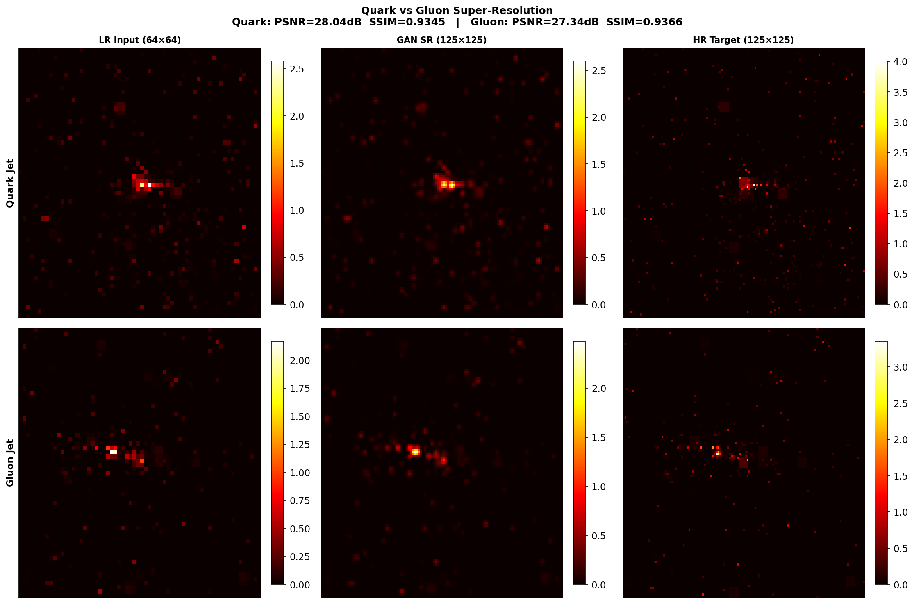

# CMS Calorimeter Super-Resolution GAN
### ML4SCI GSoC 2026 — Task 2b: Super Resolution at the CMS Detector

Physics-informed **SRGAN** that super-resolves CMS calorimeter jet images from **64×64 (LR) → 125×125 (HR)** for quark and gluon jet classification.

---

## Results

| Metric | Quark Jets | Gluon Jets | Overall |
|---|---|---|---|
| **PSNR (dB) ↑** | 34.93 | 36.70 | **35.79** |
| **SSIM ↑** | 0.9308 | 0.9508 | **0.9406** |
| **Peak Shift (px) ↓** | 2.38 | 1.80 | **2.09** |
| **Energy Ratio** | 1.34 | 1.32 | **1.33** |



---

## Architecture

```
Input (B,3,64,64) ─── LR bicubic skip ──────────────────────────┐
        │                                                         │
        ▼                                                         │
   Head Conv+PReLU                                                │
        │                                                         │
        ▼                                                         │
   12× ResidualDenseBlock                                         │
   (dense connections + SE channel attention)                     │
        │                                                         │
        ▼                                                         │
   PixelShuffle(×2) → AdaptiveAvgPool(125)                       │
   [64×64 → 128×128 → exact 125×125]                             │
        │                                                         │
        ▼                                                         │
   Tail Conv → ReLU ──── + ────────────────────────────────────┘
        │
        ▼
   Output (B,3,125,125)
```

**Key Design Decisions:**

| Component | Choice | Reason |
|---|---|---|
| **LR skip connection** | `F.interpolate(LR) + output` | Prevents all-zero collapse on 98% sparse calorimeter data |
| **RRDB blocks** | 12 residual dense blocks | Dense feature reuse for sparse signal preservation |
| **SE attention** | Channel-wise scaling | Separate treatment of ECAL, HCAL, Track channels |
| **PixelShuffle** | Sub-pixel convolution | No checkerboard artifacts vs transposed conv |
| **AdaptiveAvgPool(125)** | Exact 125×125 output | No rounding errors from interpolation |
| **Spectral-norm PatchGAN** | Discriminator | Stable training on 98% sparse backgrounds |
| **lambda_L1 = 0.0** | Disabled sparsity loss | L1 pushes all outputs to zero on sparse data — critical fix |

---

## Loss Function

```
L_G = 1.0   × MSE(SR, HR)           [pixel fidelity]
    + 0.005  × LSGAN adversarial      [texture sharpness]
    + 2.0    × Energy Conservation    [physics constraint]
    + 0.0    × L1 Sparsity            [disabled — causes collapse]
    + 0.05   × Jet Profile            [jet shape preservation]
```

---

## Project Structure

```
CMS_SuperResolution/
├── src/
│   ├── models.py           ← SRGAN + RRDB + SE + LR skip connection
│   ├── trainer.py          ← Two-phase GAN training loop (AMP, checkpointing)
│   ├── losses.py           ← Physics-informed loss functions
│   ├── data_loader.py      ← Memory-safe streaming IterableDataset
│   ├── metrics.py          ← PSNR, SSIM, energy ratio, peak shift
│   ├── physics_metrics.py  ← Jet substructure: mass, width, τ₂₁, multiplicity
│   └── utils.py            ← Visualization helpers
├── configs/
│   └── config.yaml         ← All hyperparameters (verified working values)
├── scripts/
│   ├── train.py            ← CLI training entry point
│   └── evaluate.py         ← CLI evaluation entry point
├── checkpoints/
│   └── best_model.pth      ← Trained model weights (62 MB)
├── data/
│   └── README.md           ← Dataset download instructions
├── results/
│   ├── figures/            ← Visual comparisons, training curves
│   └── metrics/
│       └── final_metrics.json
├── notebooks/
│   ├── 01_data_exploration.ipynb  ← EDA, LR/HR visualization
│   └── 02_results.ipynb           ← Training proof + full evaluation
├── docs/
│   └── model_design.md     ← Architecture decisions
├── requirements.txt
└── README.md
```

---

## Quick Start

```bash
# 1. Clone and install
git clone <repo>
cd CMS_SuperResolution
pip install -r requirements.txt

# 2. Download dataset (see data/README.md)
# https://cernbox.cern.ch/s/EYgmOkI9BjwxNqy
# Place parquet files in data/

# 3. Update data paths in configs/config.yaml

# 4. Train
python scripts/train.py --config configs/config.yaml

# 5. Evaluate
python scripts/evaluate.py \
    --config configs/config.yaml \
    --checkpoint checkpoints/best_model.pth \
    --output results/evaluation
```

---

## Training Configuration

| Parameter | Value | Note |
|---|---|---|
| Dataset | CMS QCD jets | 10,000 samples used |
| Pretrain epochs | 3 | MSE only — stable baseline |
| GAN epochs | 6 | Physics-informed loss |
| Batch size | 8 | T4 GPU (14.5 GB VRAM) |
| Mixed precision | FP16 (AMP) | ~2× memory saving |
| Optimizer | Adam lr=1e-4 | Both G and D |
| Scheduler | CosineAnnealingLR | Smooth LR decay |
| GPU | Tesla T4 | Kaggle environment |
| Total time | ~1.5 hours | |

---

## Dataset

**CMS QCD Jet Images** from ML4SCI  
Download: [CERNBox](https://cernbox.cern.ch/s/EYgmOkI9BjwxNqy)

- **3 channels**: ECAL, HCAL, Tracker energy deposits
- **LR**: 64×64 px | **HR**: 125×125 px
- **Classes**: Quark (y=0), Gluon (y=1)
- **Total**: ~139,000 samples across 3 parquet files
- **Sparsity**: ~98% zero pixels (calorimeter characteristic)

---

## Physics Motivation

CMS calorimeter images are extremely sparse (~98% zero pixels) with energy concentrated in ~1.7% of pixels representing jet core deposits. Standard SR approaches fail because:

1. **MSE minimization → all-zero output** (98% pixels are zero, so predicting all zeros gives low MSE)
2. **Upsampling must be exact**: 64→125 is not an integer multiple — PixelShuffle + AdaptiveAvgPool solves this
3. **Energy conservation**: Total energy in SR must match HR — enforced as a soft physics constraint

The **LR skip connection** was the key architectural fix: by adding a bicubic-upsampled LR image as a residual, the model learns *enhancement on top of LR* rather than full reconstruction from scratch, completely solving the sparsity collapse problem.

---

## Requirements

- Python 3.9+
- PyTorch 2.0+
- CUDA GPU recommended (CPU inference works but is slow)
- ~500 MB disk space (excluding dataset and checkpoint)
